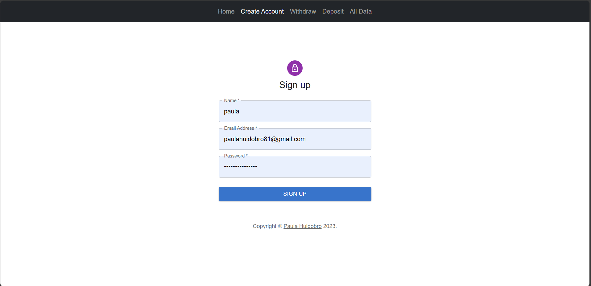
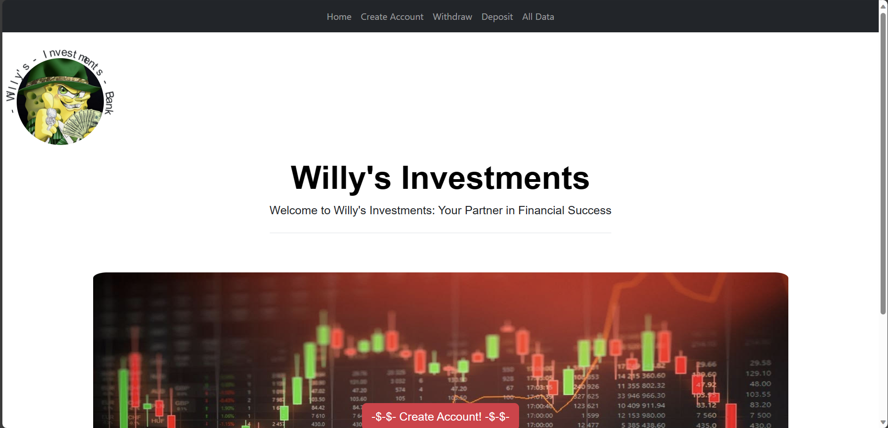

# Project Title

Bad Bank Mit

## Description/Motivation

The Bad Bank Mit project consist of a single page front end banking aplication with no security considerations and educational pourposes, with a refactoring motivation for incluiding a back end logic to it. 

## Installation Guidelines

To get started with the Bad Bank Express application, follow these steps:

1. Clone the repository:
   ```bash
   git clone https://github.com/huidobro19/badbank-mit
2. Run Npm Install:
   ```bash
   npm install

## Screenshots




## Technology Used
- React
- Node
- JavaScript
- Material Ui
- Html
- Css
- Boostrap

## Features
- Create account
- Deposit
- Withdraw
- Deposit
- All Data

- Future Features:
  - Express Server
  - Database
  - Authentification
 

## License
MIT
